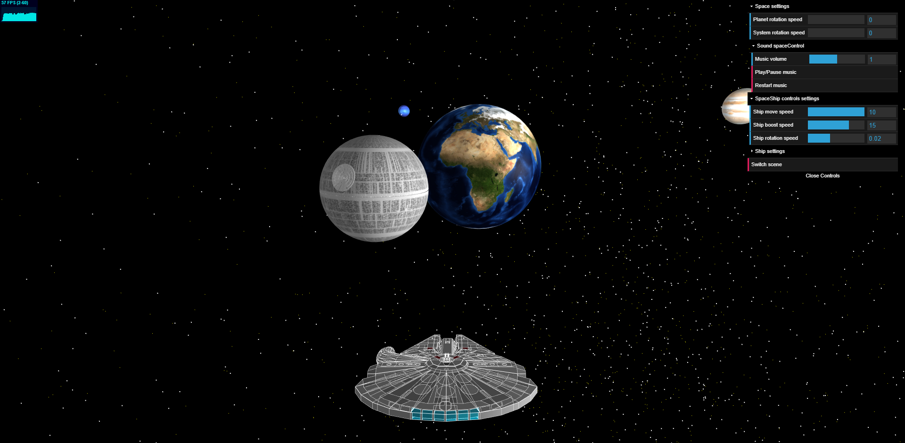
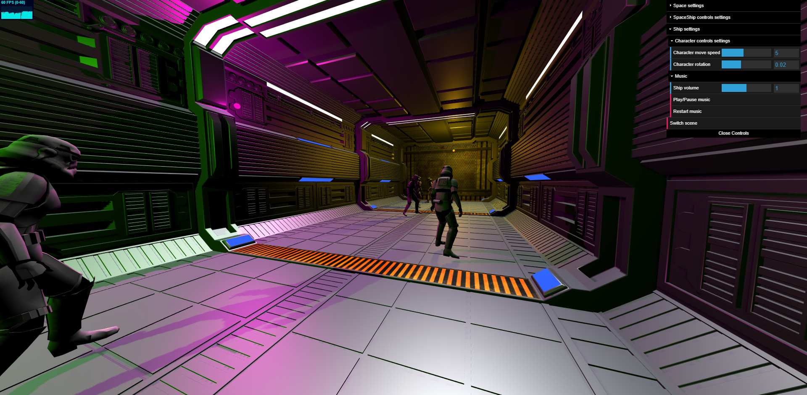
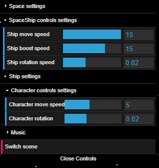

# Go To Space THREEJS

|  |  |  |  |
|:-------------------------------------------------------------------------------------:|:-------------------------------------------------------------------------------------:|:-------------------------------------------------------------------------------------:|:--------------------------------------------------------:|

A ThreeJS school project where you travel in space

## Description

Not too long ago in a fairly close galaxy, the millennium falcon got
lost...  
This world contains two scenes, one in space and the other
inside the ship. You can adjust several parameters directly from the
GUI.  
If you have an xbox controller, you can use it !

- **Space scene :** This is the main scene where you spawn at the
  beginning. You will find there the planets of the solar system. This
  is not the true scale but we recognize the planets quite easily.
- **Ship scene :** It’s sort of a bonus scene that we’ve added for fun.
  There are some stormtroopers in a kind of warehouse (tip: launch the
  music of the ship from the GUI :wink:).

## Visuals

#### Space :

|  |  |
|:--------------------------------------:|:--------------------------------------:|
|  |  |

#### Ship :

|  |  |
|:------------------------------------:|:------------------------------------:|
|  |  |

## Usage

If you play on keyboard, you might use `azerty` layout :fr:.

### Keyboard :keyboard: :

- **Move forward :** Z
- **Move backward :** S
- **Move left :** Q
- **Move right :** D
- **Camera up :** Up arrow :arrow_up:
- **Camera down :** Down arrow :arrow_down:
- **Camera left :** Left arrow :arrow_left:
- **Camera right :** Right arrow :arrow_right:
- **Camera right :** Right arrow :arrow_right:
- **Camera turn arround left :** A
- **Camera turn arround right :** E
- **Move up (only in space) :** Space bar
- **Move down (only in space) :** Left Ctrl key
- **Boost speed (only in space) :** Left Shift key

### Xbox controller :video_game: :

### GUI Settings :

We can adjust several settings directly from the GUI like the precision
of the camera, the movement speed, the rotation speed of the planets,
the music:

|  |  |  |
|:------------------------------:|:---------------------------:|:--------------------------------:|

## Authors

This project was carried out in a group of four people, myself included.

|                                                      |                                                             |
|:-----------------------------------------------------|:-----------------------------------------------------------:|
| [Baptiste DEMARCHE](https://github.com/batmine3)     |        |
| [Joëlle CASTELLI](https://github.com/JoelleCastelli) |  |
| [Swann HERRERA](https://github.com/SwannHERRERA)     |    |
| [Noé LARRIEU-LACOSTE](https://github.com/Nouuu)      |           |

## More Documentation

Here are the main sites / resources used during the development of our
project

- ThreeJS library [threejs](https://threejs.org/)
- Gamepad Control [html5gamepad](https://html5gamepad.com/)
- Solar system textures
  [solarsystemscope](https://www.solarsystemscope.com/textures/)
- 3D objects
  [turbosquid](https://www.turbosquid.com/Search/3D-Models/free/fbx)
  [open3dmodel](https://open3dmodel.com/3d-models/dae)
  [sketchfab](https://sketchfab.com/tags/fbx)
  [cadnav](http://www.cadnav.com/3d-models/sort-21.html)
- 3D animations [mixamo](https://www.mixamo.com/)

